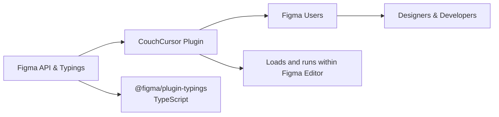

# CouchCursor

## Overview
CouchCursor is a Figma plugin module designed to enhance and extend the default user workflow within the Figma design environment. Its primary purpose is to provide seamless integration into Figma, enabling users to interact with design elements more efficiently by leveraging plugin-driven capabilities.

## Key Features
- **Figma Plugin Integration**: Embeds directly into the Figma interface as a plugin, making it easily accessible to users from within their design projects.
- **Enhanced User Interaction**: Facilitates improved design manipulation and navigation within Figma, aiming to streamline common tasks.
- **Build and Watch Workflow**: Offers streamlined development with build and watch scripts for quick iteration of plugin features.

## System Errors
- **Plugin Loading Error**: Occurs if the plugin fails to initialize or load within Figma.  
  _Resolution_: Ensure all dependencies are installed and the project is built using the provided scripts.
- **Version Compatibility Error**: Triggered by mismatched Figma API typings or incompatible Figma environments.  
  _Resolution_: Update `@figma/plugin-typings` to a compatible version and verify Figma client compatibility.

## Usage Examples
Practical code examples for building and using the plugin module:

```bash
# Install dependencies
npm install

# Build the plugin
npm run build

# Watch for changes in development
npm run watch

# In Figma: 
# 1. Go to Plugins > Development > New Plugin... 
# 2. Link to the generated 'manifest.json' and 'code.js' produced by the build process
# 3. Run CouchCursor from Figma's plugin menu
```

## System Integration
