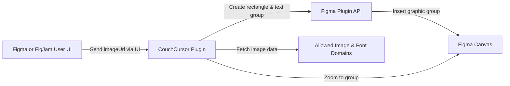

# CouchCursor Plugin API

## Overview
CouchCursor is a Figma and FigJam plugin that allows users to insert a custom "Couch Cursor" graphic into their canvas. The plugin enables users to provide an external image URL, which is fetched and applied as a fill to a predefined rectangle. A stylized text label is also added, and both the image and text are grouped for easy manipulation within the canvas. This module serves as a creative tool to visually indicate collaboration or to add fun annotations in collaborative design environments.

## Key Features
- **Insert Couch Cursor Graphic**: Fetches an external image and places it on the canvas within a stylized rectangle, providing a consistent look and feel.
- **Custom Label Creation**: Automatically places a "Cursors chill couch" text label above the image for easy identification.
- **Automated Grouping**: Combines the image and label into a group, making it easy to move, edit, or manipulate as a single unit.
- **Seamless Canvas Integration**: Ensures the created group is centered in the viewport and ready for immediate collaboration or demonstration.
- **Supports Figma and FigJam**: Operates in both Figma design and FigJam whiteboarding environments, making it versatile for different workflows.

## System Errors
- **Image Fetch Failure**: The plugin may not be able to fetch the image from the provided URL due to invalid links, network issues, or domain restrictions.
  - *Resolution*: Ensure the image URL is accessible and belongs to an allowed domain (`static.figma.com`, `fonts.googleapis.com`, `fonts.gstatic.com`, `i.postimg.cc`).
- **Font Loading Failure**: If the "Roboto Bold" font cannot be loaded, the text label may not render as intended.
  - *Resolution*: Verify network connectivity and ensure font domains are not blocked.
- **Invalid UI Message**: If the plugin receives a message of the wrong type or a missing `imageUrl`, no cursor will be created.
  - *Resolution*: Use the plugin UI as intended; always provide a valid image URL.

## Usage Examples

```typescript
// Example: Using the plugin UI to insert a Couch Cursor graphic

// STEP 1: Launch CouchCursor plugin from Figma or FigJam
// STEP 2: Enter a valid image URL when prompted (should be hosted on an allowed domain)
// STEP 3: Click "Create Couch Cursor"

// The plugin will:
// - Fetch the image
// - Create a 400x200 rectangle filled with the image
// - Add a "Cursors chill couch" text label in Roboto Bold
// - Group both elements for easy repositioning
// - Zoom viewport to the new group

// Example image URL for testing:
// https://i.postimg.cc/DZ3yYq6c/sample-couch.png
```

## System Integration


