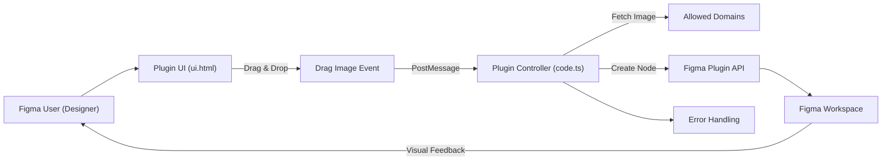

# CouchCursor Architecture

## Overview
CouchCursor is a Figma/FigJam plugin that allows users to drag and drop a selection of "couch" images onto their workspace, instantly generating a visually styled group. Each dropped image creates a named rectangle with the chosen couch as its fill and an overlaid text label, streamlining the process of organizing and visually identifying layers with a playful touch.

## Key Features
- **Drag & Drop Couch Selector**: Users can pick from a gallery of couches, dragging any image onto the plugin interface to initiate the creation process in Figma.
- **Dynamic Canvas Creation**: Each interaction generates a rectangle filled with the selected image and positions it precisely on the canvas, accompanied by a centered text label "Cursors chill couch".
- **Layer Grouping and Naming**: The rectangle and text are grouped and named "Couch Cursor", making organization and subsequent edits easier.
- **Font Loading and Styling**: Ensures that the appropriate font ("Roboto", Bold, 32px) is loaded before inserting text, guaranteeing visual consistency.
- **Multi-Editor Support**: Works in both Figma Design and FigJam environments, as specified in the manifest.

## System Errors
- **Image Loading Error**: 
  - **Description**: Failure to fetch or decode the selected couch image from the external URL.
  - **Resolution**: Ensure the image URL is correct and reachable. Verify network settings and allowed domains in the plugin manifest.
- **Font Loading Error**: 
  - **Description**: Font "Roboto" (Bold) could not be loaded for the text node.
  - **Resolution**: Confirm that the font is supported and accessible in the Figma editor.
- **Message Handling Error**: 
  - **Description**: Plugin UI fails to post a message to the code.js controller or the controller does not respond.
  - **Resolution**: Ensure the plugin's UI and code backs are in sync and no browser-related constraints are blocking message passing.

## Usage Examples

```typescript
// From the plugin UI (ui.html), user drags and drops a couch image.


// When drag ends, the following message is sent:
parent.postMessage({ pluginMessage: { type: 'create-couch-cursor', imageUrl: "https://i.postimg.cc/zDsMPXRC/couch1.png" } }, '*')

// In the Figma plugin controller (code.ts), this triggers:
figma.ui.onmessage = async msg => {
  if (msg.type === 'create-couch-cursor' && msg.imageUrl) {
    // Fetch image, create rectangle, load font, create text, group nodes in Figma
  }
}
```

## System Integration



- **Dependencies**: Figma Plugin API, Allowed Image/Font Domains
- **This Module**: CouchCursor plugin consisting of UI (image gallery, drag-and-drop) and Code (canvas manipulations)
- **Used By**: Figma/ FigJam end-users (Designers wanting quick, visual layer labels)
- **[Details]**: manifest.json (permissions, allowed domains), package.json (build & types)
- **[Process]**: Image selection → message sent → backend image fetch & node creation → workspace update
- **[Consumers]**: Figma workspace (layers, groupings visible to all document collaborators)

This architecture empowers users to add functional, decorative groupings to their design files, simplifying identification and adding creative fun directly within Figma/FigJam.