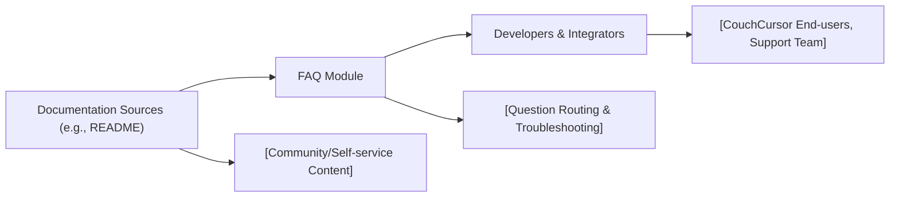

# CouchCursor FAQ

## Overview
This FAQ module provides answers to common questions and concerns developers may have when integrating or using CouchCursor within their projects. Its purpose is to improve onboarding, clarify functionality, and reduce redundant support, ensuring a smoother experience with CouchCursor. 

## Key Features
- **Common Questions Coverage**: Addresses frequently encountered queries about installation, configuration, usage, and limitations of CouchCursor.
- **Troubleshooting Guidance**: Offers practical advice for resolving common errors and integration issues.
- **Integration Best Practices**: Shares recommended approaches to incorporate CouchCursor effectively in broader architectures.

## System Errors
- **Installation Issues**: Errors when installing dependencies or package.  
  _Resolution_: Ensure compatible Node and NPM versions. Double-check package managers and repository access.
- **Connection Failures**: Problems connecting to CouchDB or external data sources.  
  _Resolution_: Verify credentials, network access, and that CouchDB is running and reachable from your environment.

## Usage Examples
Practical coverage of commonly asked questions:

```
# Q: How do I install CouchCursor?
npm install couch-cursor

# Q: What Figma integration is supported?
CouchCursor allows plug-in integration with Figma via the API—just provide the relevant Figma API key and endpoint in configuration.

# Q: How do I troubleshoot database connection errors?
Check your CouchDB URI, network connectivity, and authentication info in your configuration file.
```

## System Integration

