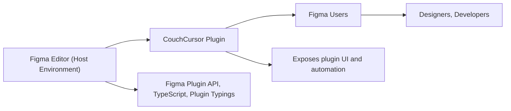

# Getting Started with CouchCursor

## Overview
CouchCursor is a Figma plugin designed to enhance your Figma design workflow. It integrates directly into the Figma editor, providing users with additional features and streamlined processes for working with design elements. This module enables you to extend Figma's native capabilities, making repetitive or complex tasks simpler to execute.

## Key Features
- **Figma Plugin Integration**: Seamlessly adds new functionality right within your Figma workspace. Users can trigger plugin actions from the editor to automate or augment their design tasks.
- **Custom User Workflow Support**: Enables tailored workflows that speed up design iteration and foster collaboration.
- **Build and Watch Scripts**: Simplifies plugin development with convenient commands for building and automatically watching file changes.

## System Errors
- **Plugin Load Failure**: This error occurs if the plugin fails to load within Figma, often due to a missing or misconfigured manifest or build artifacts.
  - **Resolution**: Ensure the build process (`npm run build`) completes successfully, and all required files are present in the plugin package.
- **Script Compilation Error**: Happens when TypeScript compilation fails.
  - **Resolution**: Check the build log for errors and confirm your TypeScript files adhere to the configured TypeScript standards.

## Usage Examples

```bash
# Install dependencies (from your plugin directory)
npm install

# Build the plugin for Figma
npm run build

# During development, enable auto-rebuild on code changes
npm run watch

# After building, load the `manifest.json` (not shown) and plugin files in Figma as an "imported plugin".
```

## System Integration

